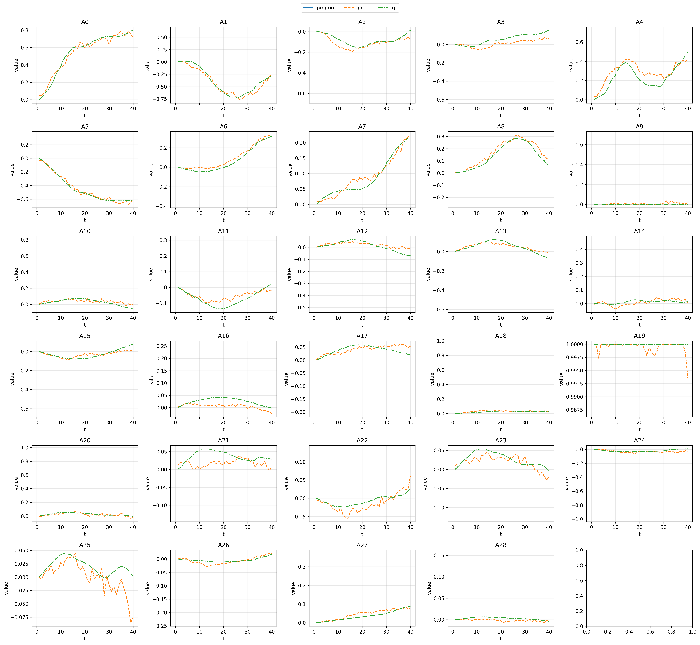

# DP
Diffusion Policy training and inference infrastructure repo

## Installation
Clone the repository and initialize submodules:
```bash
git clone --recurse-submodules https://github.com/uynitsuj/dp.git
# Or if already cloned without --recurse-submodules, run:
git submodule update --init --recursive
```
Install dependencies and main package using uv:
```bash
cd dp
curl -LsSf https://astral.sh/uv/install.sh | sh
uv venv --python 3.11
source .venv/bin/activate
uv sync
uv pip install -e .
uv pip install submodules/transformers[torch] # Requires transformers nightly for dinov3 ViT
```

## Defining training configs and running training
To fine-tune a model on your own data, you need to define configs for data processing and training. Example [configs](dp/util/config.py) are provided (styled after PhysicalIntelligence/openpi configs), starting from standard format lerobot dataset, which you can modify and add interfaces for your own dataset format.

Dataset normalization statistics are computed and applied to data automatically prior to training.

We run training with the command:
```bash
uv run scripts/train.py dp_xmi_rby --exp-name=my_experiment
```

## Post train sanity check -- Evaluate a policy on a dataset
In `scripts/inference.py` modify paths:

```python
@dataclasses.dataclass
class InferenceConfig:
    # path to model checkpoint
    model_ckpt_folder: str = "/home/dp/trained_policy_example_dir"
    ckpt_id : int = 199
```
Then run:
```bash
uv run scripts/inference.py
```

You should see plots comparing ground truth trajectory data from the train dataset and action chunks predicted by the diffusion policy 

## Deploying the Policy
To deploy the policy, you can either instantiate the DiffusionWrapper class directly, or use `scripts/serve_policy.py` to remotely serve (on another workstation connected to the same local network, or the same workstation with IPs set to localhost)

In `scripts/serve_policy.py` modify 
``` python
@dataclass
class ServerConfig:
    model_ckpt_folder: str = "/home/dp/trained_policy_example_dir"
    ckpt_id: int = 199
    host: str = "0.0.0.0"
    port: int = 8111
    device: str = "cuda" 
```

Then run:
```bash
uv run scripts/serve_policy.py
```

Your physical robot control wrapper will need this client websocket code in order to send observations and receive predicted action chunks from the server:

``` python
class DiffusionWebsocketClientPolicy:
    """Wrapper for the diffusion policy websocket client."""

    def __init__(self, host: str = "localhost", port: Optional[str] = None) -> None:
        self._uri = f"ws://{host}"
        if port is not None:
            self._uri += f":{port}"
        self.ws = None
        self._packer = msgpack_numpy.Packer()
        self._ws, self._server_metadata = self._wait_for_server()

    def get_server_metadata(self) -> Dict:
        return self._server_metadata

    def _wait_for_server(self) -> Tuple[websockets.sync.client.ClientConnection, Dict]:
        logging.info(f"Waiting for server at {self._uri}...")
        while True:
            try:
                conn = websockets.sync.client.connect(
                    self._uri,
                    compression=None,
                    max_size=None,  # , additional_headers=headers
                )
                metadata = msgpack_numpy.unpackb(conn.recv())
                return conn, metadata
            except ConnectionRefusedError:
                logging.info("Still waiting for server...")
                time.sleep(5)

    def infer(self, obs: Dict[str, np.ndarray]) -> Dict:
        data = self._packer.pack(obs)

        self._ws.send(data)
        response = self._ws.recv()
        if isinstance(response, str):
            # we're expecting bytes; if the server sends a string, it's an error.
            raise RuntimeError(f"Error in inference server:\n{response}")
        return msgpack_numpy.unpackb(response)
```

Your controller will instantiate the websocket client policy with:
``` python
_websocket_client_policy = DiffusionWebsocketClientPolicy(host="0.0.0.0", port=8111)
```
and will call inference with 
``` python
self._websocket_client_policy.infer(current_obs)
```
with current_obs being a correctly constructed dictionary containing valid proprio and image observations (expected keys look like "state", "cam_key_1", "cam_key_2", etc.). 

## Linting
If contributing, please use ruff (automatically installed) for linting (https://docs.astral.sh/ruff/tutorial/#getting-started)
```bash
ruff check # lint
ruff check --fix # lint and fix anything fixable
ruff format # code format
```

## Roadmap/Todos

- [x] Make DataConfig a ConfigFactory so that it's more extensible to different data formats
- [x] Make lerobot datasets an acceptable input dataset format (no need to write a new dataloader, just convert and cache data mp4->jpg and paraquet->hdf5 prior to train)
- [x] Add DINOv3 ViT option for Diffusion Policy
- [ ] Develop remote inference wrapper
- [ ] Currently dataloader is hardcoded for single timestep obs, fix this lol